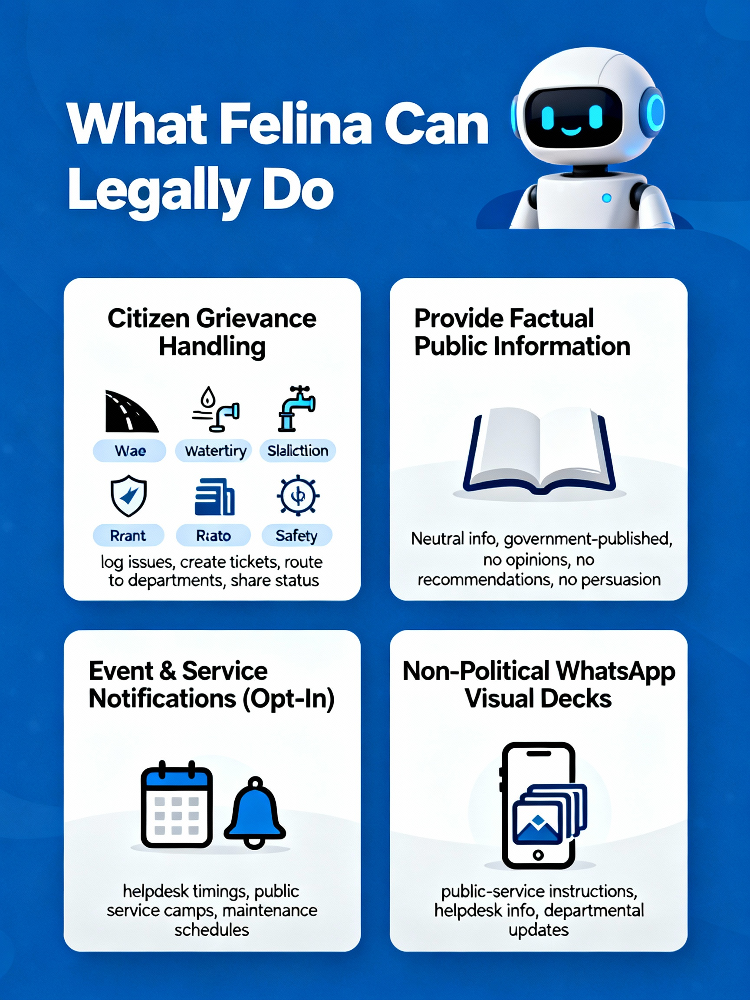
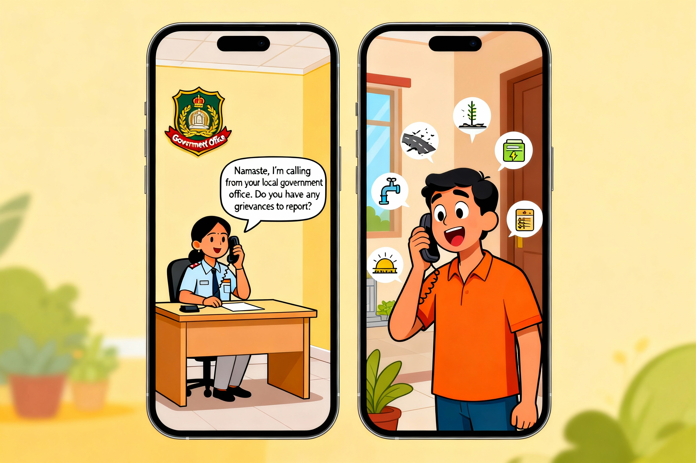
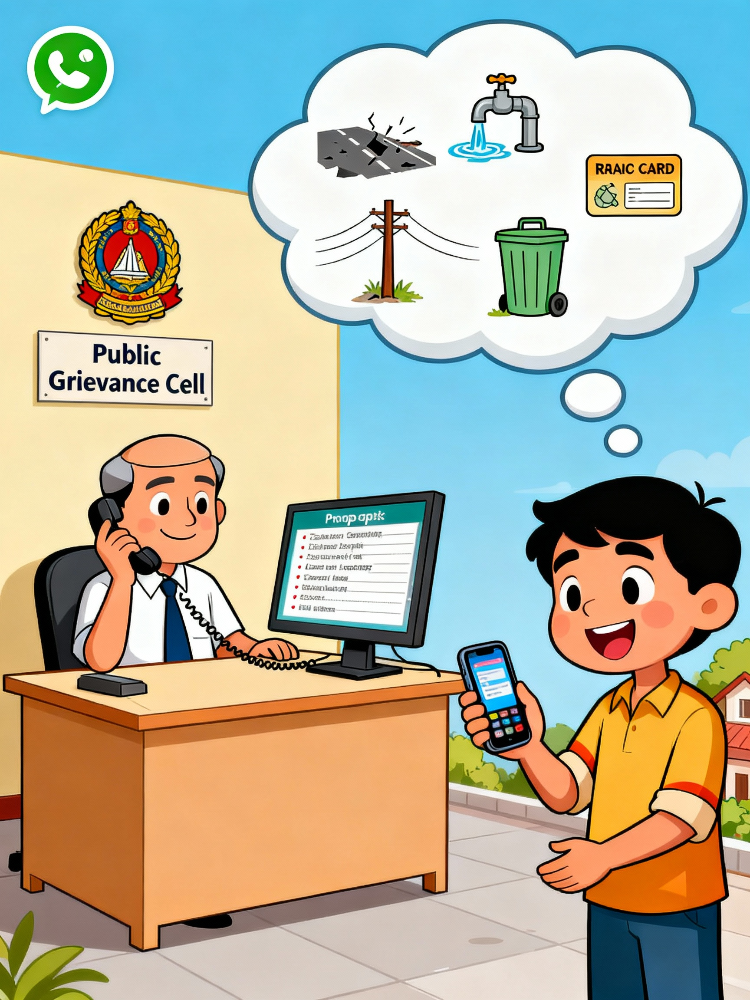
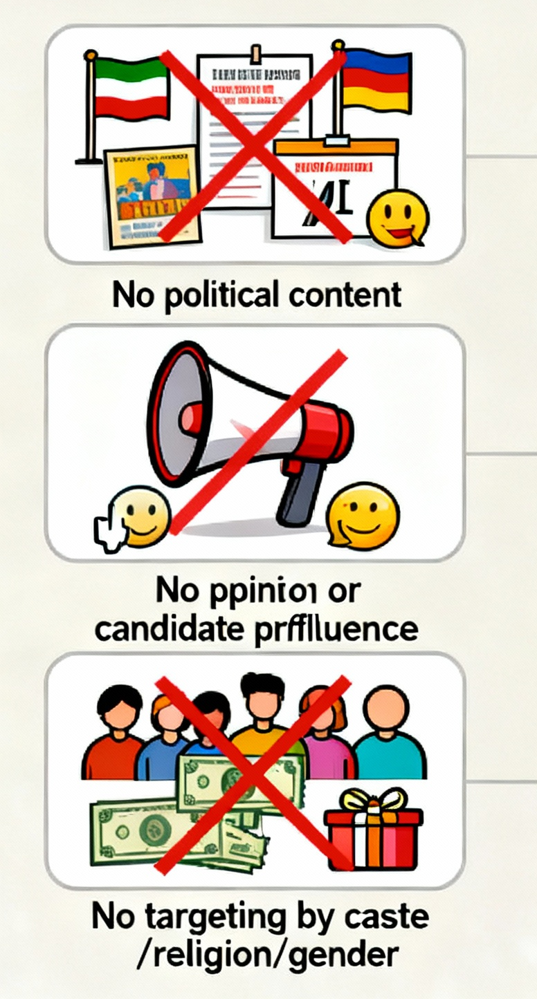
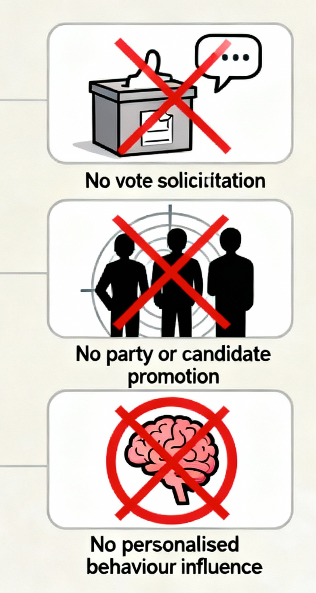
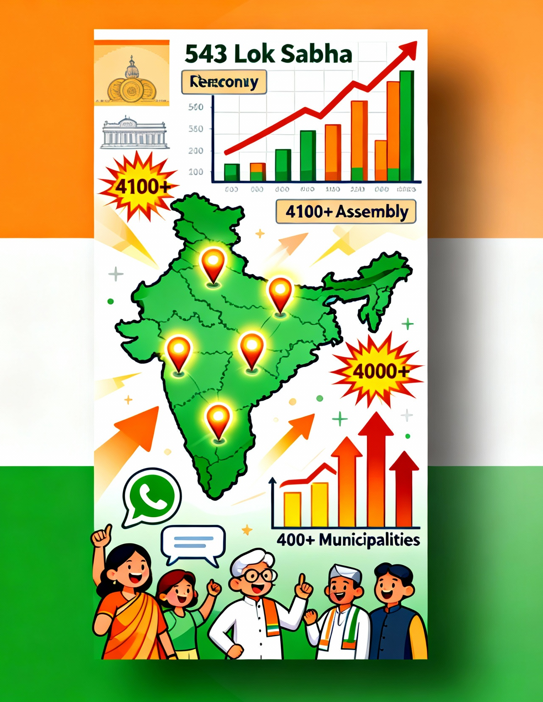
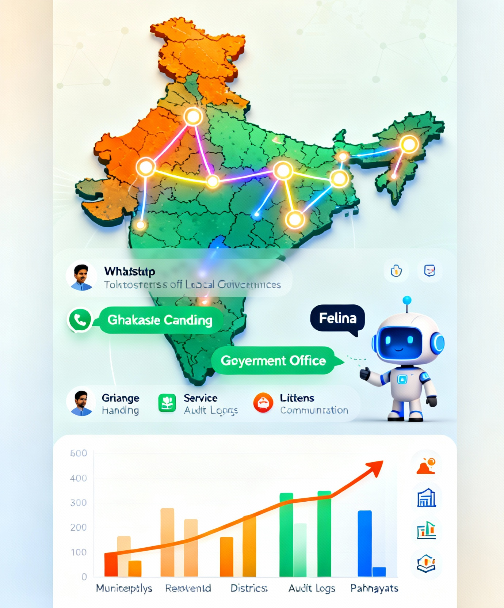
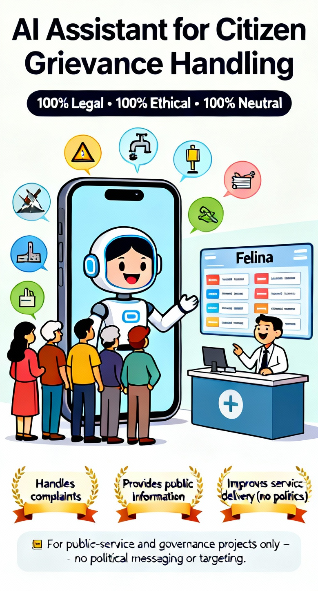

# 🤖 BillianceAI — Felina  
## 🎯 AI Assistant for Citizen Grievance Handling 

<table>
<tr>
<td width="40%" align="center" valign="middle">

</td>
<td width="60%" valign="top">

## 🚀 Overview

Felina is an AI-powered citizen grievance assistant designed to help public service offices, municipalities, and helpdesks communicate with citizens responsibly.

It handles complaints, provides information, and improves service delivery — **without political messaging, persuasion, or targeted outreach**.

This README follows strict legal-safe standards suitable for GitHub and public governance projects.

> Transparent Neutral AI Tool

## 1️⃣ Vision

Felina focuses strictly on:

✔ Public grievance handling  
✔ Transparent communication  
✔ Information delivery  
✔ Service accessibility  

❌ No persuasion  
❌ No political messaging  
❌ No targeted outreach  

**Tagline:**  
> **“Inform, Listen, Resolve — 100% Legal • 100% Ethical** 

</td>
</tr>
</table>

---

<table>
<tr>
<td width="50%" align="center" valign="middle">

</td>
<td width="80%" valign="top">

## 2️⃣ What Felina *Can Legally* Do

### ✅ 1. Citizen Grievance Handling
- Log issues (roads, water, electricity, sanitation, ration, welfare, safety)  
- Create service tickets  
- Route complaints to relevant departments  
- Share status updates  

### ✅ 2. Provide Factual Public Information
- Neutral, government-published information  
- No recommendations, opinions, or interpretation  
- No persuasion of any kind  

### ✅ 3. Event & Service Notifications (Opt-In)
- Helpdesk timings  
- Public service camps  
- Maintenance schedules  

### ✅ 4. Non-Political WhatsApp Visual Decks
- Public-service instructions  
- Helpdesk info  
- Departmental service updates  

</td>
</tr>
</table>

---

## 3️⃣ Sample Safe Conversation Scripts

<table>
<tr>
<td width="50%" align="center" valign="middle">

</td>
<td width="60%" valign="top">

### **1. Consent + Greeting**
Hello! I am Felina, the Citizen Helpdesk AI Assistant.
I can help with grievance registration and public information.
Shall I continue? Reply YES to give consent.

### **2. Grievance Intake**
**Citizen:** “Streetlight is not working.”

**Felina:**  
Thank you for reporting this issue.
May I record your location to create a service request?

**Citizen:** “Yes.”

**Felina:**  
Service Request #1298 created.
You will receive updates here.

### **3. Information Request**
**Citizen:** “Need Water supply schedule for my area”

**Felina:**  I can share the official water-supply schedule for your area.
Would you like to receive it? Reply YES.

### **4. Public Service Update**
A sanitation maintenance activity will take place on 15 Dec at 5 PM.
Would you like a reminder? Reply YES to opt-in.

</td>
</tr>
</table>

---

<table>
<tr>
<td width="50%" align="center" valign="middle">

</td>
<td width="60%" valign="top">

### **5. Felina's follow-Up (For Citizens Who Already Raised Complaints)**

These interactions strictly follow service-based, consent-driven communication:

Felina can legally:

> **Call citizens who previously raised complaints (service calls, not outreach)**

- Ask clarifying questions to understand the issue better
“Can you confirm the pole number near the damaged streetlight?”

- Provide status updates on ongoing complaints
“Your complaint is currently assigned to the electrical maintenance team.”

- Verify resolution
“Has the issue been fixed to your satisfaction?”

- Escalate unresolved issues to the appropriate officer
“This has been escalated to the Assistant Engineer for urgent action.”

- Log every conversation for audit and transparency

- Provide structured dashboards to MLA/MLC office staff for monitoring

</td>
</tr>
</table>

---

<table>
<tr>
<td width="40%" align="center" valign="middle">

</td>
<td width="60%" valign="top">

## ❌ What Felina *Will Not* Do (Legally Prohibited)

- No political content  
- No vote solicitation  
- No opinion influence  
- No promotion of any party/candidate  
- No targeting based on caste/religion/gender  
- No inducements or benefits  
- No personalised behaviour influence  

---

## 4️⃣ Legal & Ethical Principles (Strict)

### ✔ AI Transparency
All messages clearly state:

### ✔ Consent-Based Communication
- Explicit “YES” consent required  
- “STOP” to unsubscribe  
- No unsolicited messaging  

### ✔ TRAI / DLT Compliance
- Approved sender ID  
- Approved message templates  
- Strict anti-spam adherence  

### ✔ No Sensitive Data Collection
Felina does **not** collect/store:
- Caste  
- Religion  
- Political affiliation  
- Income  
- Health data  
- Voter preferences  

### ✔ Immutable Audit Logs
- All interactions logged  
- Secure, tamper-proof storage  
- Exportable for audit/RTI needs  

</td>
</tr>
</table>

---

<table>
<tr>
<td width="40%" align="center" valign="middle">

</td>
<td width="80%" valign="top">

## 5️⃣ Code of Conduct

By contributing, you agree to:

- Avoid political features  
- Maintain full neutrality  
- Not store sensitive data  
- Keep transparency as default  

Violating PRs will be rejected.

## 6️⃣ Deployment Checklist

## ✔ Legal Approvals
- TRAI/DLT compliance check  
- Privacy & data retention policy review  

## ✔ Technical Setup
- WhatsApp Business API  
- Helpdesk number  
- Consent engine  
- Logging & audit system  

## ✔ Policy Setup
- Transparency policy  
- Data protection policy  

## ✔ Dry Run
- Test all scripts  
- Validate filters  
- Check multi-language readiness  

</td>
</tr>
</table>

---

## 📊 7️⃣ Market Opportunity

Felina is not a political tool — it is a citizen service infrastructure that any public office can deploy.
Every constituency, municipality, and department handles thousands of complaints monthly, creating a massive adoption potential.

<table>
<tr>
<td width="40%" align="center" valign="middle">

</td>
<td width="60%" valign="top">

### 🌍 A. Universal Demand Across India

India has:

- 543 Lok Sabha constituencies

- 4,100+ Assembly constituencies

- 4,000+ Municipalities/Corporations

- 766 District Collector Offices

- 2.5 lakh Panchayats

- Dozens of government departments per state

Every one of them needs:

- Grievance handling

- Service request tracking

- Transparent updates

- Audit logs

- Citizen communication

➡️ Felina fits every one of these use cases.

</td>
</tr>
</table>

---

<table>
<tr>
<td width="40%" align="center" valign="middle">

</td>
<td width="60%" valign="top">

### 🚀 B. One Deployment = Statewide Replication

If Felina shows real improvement in even one region, it becomes a case study for:

- Municipal Commissioners

- District collectors

- State departments

- Smart City Missions

- Case studies drive rapid scaling.

- Other MLAs/MP offices

---

### 📈 C. Total Addressable Market (TAM)

Segment	Count	Potential Deployments

-  Lok Sabha Constituencies	543
- Assembly Constituencies	4,100+
- Municipalities	4,000+
- District Collector Offices	766	
- Panchayats	250,000	Selective deployments

> **Even 10% adoption → 50,000 deployments.**

</td>
</tr>
</table>

---

<table>
<tr>
<td width="30%" align="center" valign="middle">

</td>
<td width="60%" valign="top">

### 📲 D. WhatsApp = Zero-Friction Adoption

- 480M+ WhatsApp users in India

- Government offices already use WhatsApp

- No new apps for citizens

> Felina plugs directly into existing workflows.

---

### 🔧 E. Pain Points Felina Solves

✔ High citizen footfall
✔ Delayed resolutions
✔ No ticket tracking
✔ No audit logs
✔ Staff overload

Felina provides:

- Automated complaint intake

- Real-time updates

- Department routing

- Immutable logs

- Transparent dashboards

</td>
</tr>
</table>

---

<table>
<tr>
<td width="40%" align="center" valign="middle">

</td>
<td width="60%" valign="top">

### 💰 F. Revenue Potential (Neutral & Safe)

Conservative model:

- ₹1,00,000 per office/year

- 4,000 municipalities → ₹400 crore

- 4,000 constituencies → ₹400 crore

- Even 1% of this → Unicorn-scale opportunity.

> **Unicorn-scale opportunity - a startup valued at $1 billion+**

### Practcally

👉 The total potential market is so huge that
even if our product captures just 1% of it,
the company’s valuation and revenue can grow to the level of a unicorn (a startup valued at $1 billion+).

In simple words:

The market is massive.

You don’t need 50% or 20% or even 5% of it.

Just 1% is enough to make the company extremely big and highly valuable.

> Example:
> If the total market is ₹50,000 crore,
> **1% of it = ₹500 crore business.**

- Even 1% of this → Unicorn-scale opportunity.

</td>
</tr>
</table>

---

### ⭐ G. Why Felina Wins

- 100% neutral

- 100% TRAI/DLT compliant

- WhatsApp-first

- Multi-language

- Highly scalable

- Audit-ready

> **No major competitor covers grievance handling with this legal & ethical safety focus.**

---

##  8️⃣ Built-In Technical Safeguards

### 🛡️ 1. Consent Engine
- Timestamps  
- Hashed proof of consent  
- Validates before sending messages  

### 🛡️ 2. Content Safety Filter
Blocks:
- Political content  
- Persuasive content  
- Targeted messaging  
- Inducements  

### 🛡️ 3. Targeting Restrictions
Allowed:  
- Location/ward  
- Language preference  
- User voluntary opt-in  

Not allowed:  
- Caste  
- Religion  
- Gender  
- Political leaning  

### 🛡️ 4. Human Review Layer
- All outgoing messages require admin approval  

### 🛡️ 5. Immutable Logs
- Complete transcripts  
- Audit-ready storage  

---

<table>
<tr>
<td width="50%" align="center" valign="middle">

</td>
<td width="80%" valign="top">

## 9️⃣ Legal Appendix (Quick Rules)

## ✔ Allowed
- Grievance handling  
- Neutral public information  
- Service notifications  
- Non-political info PDFs  

## ❌ Not Allowed
- Vote asking  
- Political content  
- Persuasion  
- Inducements  
- Sensitive-targeting  

## ⚠️ Legal Disclaimer
  
For final approval, consult:
- A legal expert  
- TRAI/DLT guidelines  
- Government IT policy  

</td>
</tr>
</table>

---

<table>
<tr>
<td width="40%" align="center" valign="middle">

</td>
<td width="80%" valign="top">

# ✅ Conclusion

Felina is a **neutral, non-political, citizen grievance assistant**.

It helps improve:
- Transparency  
- Responsiveness  
- Public service delivery  

While staying fully compliant with:
- TRAI/DLT telecom rules  
- Data privacy standards  
- Ethical AI norms  

A clean, safe, legally perfect AI for **citizen service — never politics**.

</td>
</tr>
</table>

